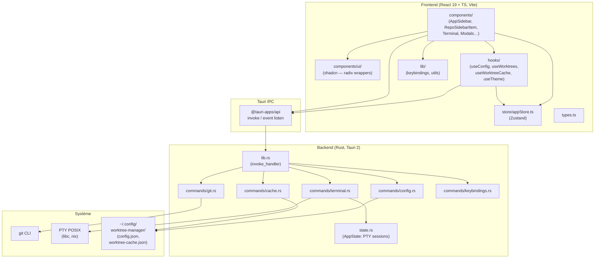
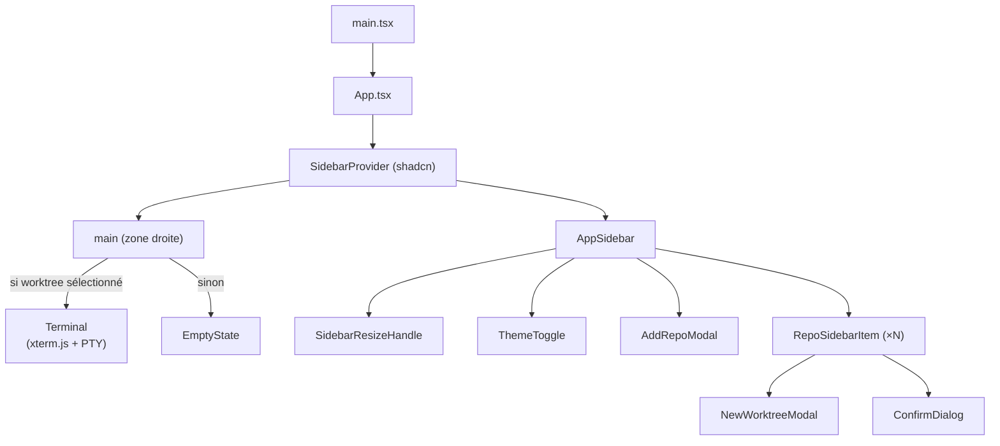
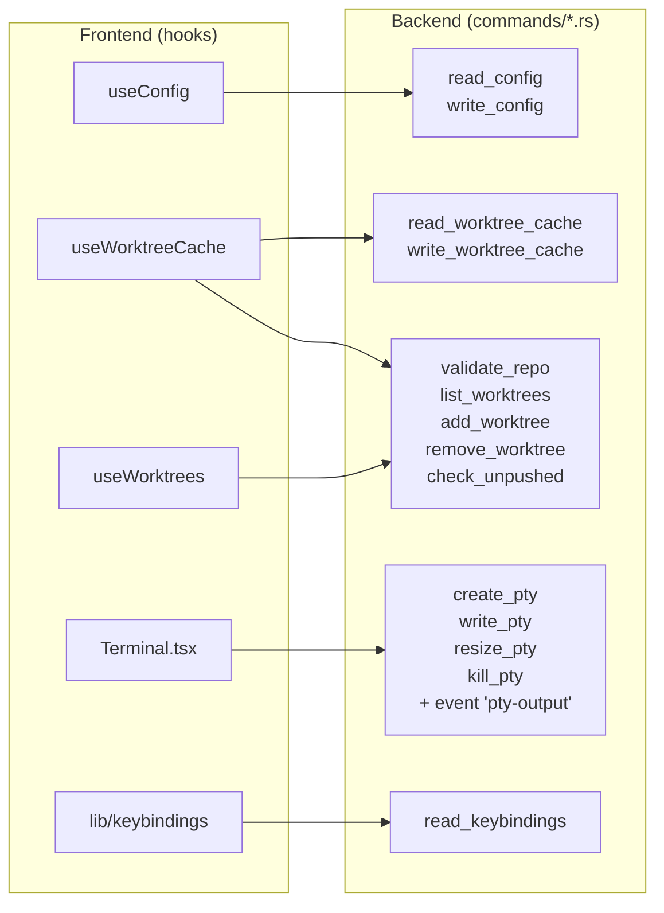
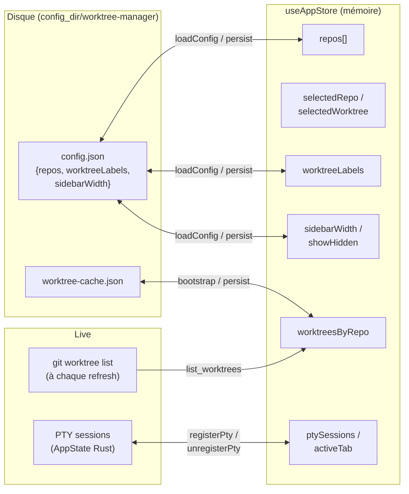
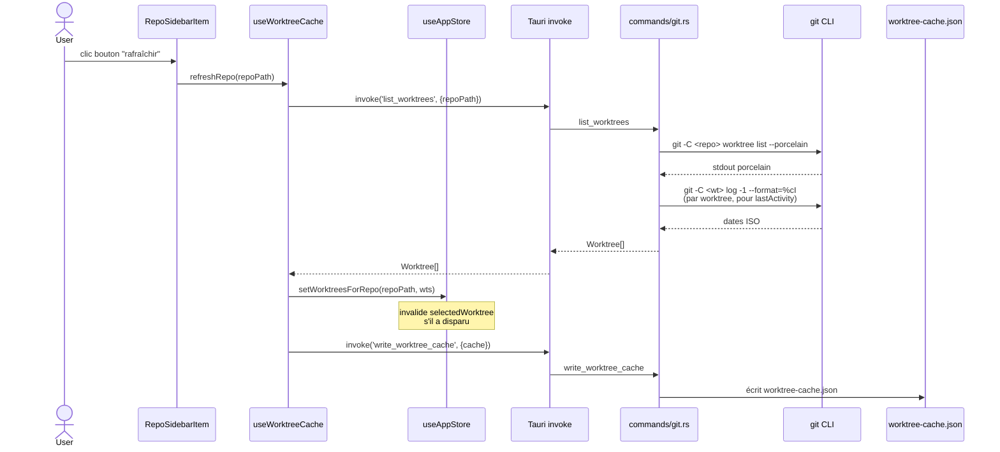
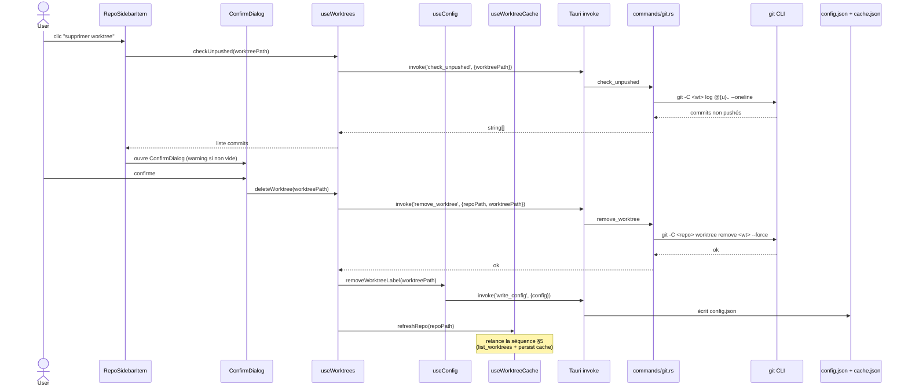
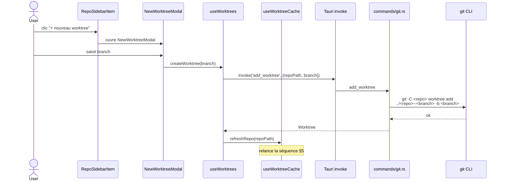

# Architecture — arborescence

Gestionnaire de worktrees Git, app desktop Tauri (React/TS + Rust).

## 1. Diagramme de packages (vue macro)

## 2. Hiérarchie des composants React

## 3. Flux IPC : commandes Tauri exposées

## 4. State (Zustand) & persistance

## 5. Séquence type — liste des worktrees (refresh d'un dépôt)

## 6. Séquence type — suppression d'un worktree

## 7. Séquence type — création d'un worktree

## En résumé

- **Stack** : Tauri 2 + React 19 + Zustand + xterm.js, UI shadcn (Radix + Tailwind v4).
- **Backend Rust** = 5 modules de commandes (`git`, `terminal`, `config`, `cache`, `keybindings`) + un `AppState` qui détient les sessions PTY.
- **Frontend** = 3 hooks pivots (`useConfig`, `useWorktreeCache`, `useWorktrees`) qui font le pont Zustand ↔ IPC, et un `Terminal` qui gère son propre cycle de vie xterm/PTY via events `pty-output`.
- **Persistance** = deux fichiers JSON dans `~/.config/worktree-manager/` (config + cache des worktrees pour bootstrap rapide).
